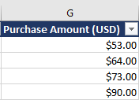

# SHOPPING DATA ANALYSIS PROJECT
## INTRODUCTION:
This is an excel project on shopping store. The project is carried out to review, analyze and derive insight to answer crucial questions and help the marketing department make data driven decision.
## PROBLEM STATEMENT:
The marketing department aims to launch a campaign in the second quarter of 2024. However, they require a dashboard to monitor business activity during the waiting period. This will provide insights into where to channel the campaign efforts. The Marketing lead would like to track various metrics over time, including:
1. Product performance 
2. Changes in customers' choice of color
3. Location, and seasonality patterns in relation to orders.
4. category performance based on order
5. customer order based on age
   
## SKILL DEMONSTRATED:
In analyzing the dataset, I applied certain skills in analyzing and deriving insight. These skills include carrying out descriptive analysis, pivoting to summarize the dataset, data cleaning/transformation and statistics.
## DATA SOURCING:
I had to task myself to review, analyze and create visuals for a dataset obtained on google drive which was provide by data-nex instructor. the dataset is about of shopping made by consumers. The reason for the analysis is to understand consumers preference and choices among the product categories, trends and patterns that would be helpful for product development and marketing.
## DATA TRANSFORMATION/DATA CLEANING:
In ensuring quality and reliability of the dataset. Columns were checked for duplicates, checked for inconsistencies, errors, and inaccuracies, blank cells and outliers within the dataset. The following were keys steps used in ensuring the dataset was ready for analysis.
1. Removed duplications
2. Data sorting
3. Data filtering
4. Replaced values
5. Conditional formatting
6. Splitting cells
7. Use of formulas/functions
8. Cell referencing
   
## CLEANING THE DATA
After reviewing the dataset, it was discovered that the dataset has blank cells, incomplete data, improper formatting and inconsistencies in certain columns.
Customer column, has an incomplete and missing values within the column. This was identified using filter option to identify the issue.
**Table 1:** 
shows the Customer id column before and after
column before                     | column After 
:--------------------------------:|:-----------------------------:
        | 

**Table 2:**

Shows the category column: during review it was discovered that in the category column we had footwear and foot wear using the filter option. We had to use the replace functionality to correct the error. Column before and after.
column before                     | column After 
:--------------------------------:|:-----------------------------:
                             | 

**Table 3:** 

Shows the color column, during review it was discovered that in the color column we had blank cell wear using the filter option. We had to use the “Not available” to replace the blank cells. Column before and after.
column before                     | column After                       | column before                   | column after                                       
:--------------------------------:|:----------------------------------:|:------------------------------:|:---------------------------------:
               |               |   | 
                     
 

    
**Table 4:**

Shows the color column, it was discovered that in the Age column two outliers were found using the filter option. Age column before and after.
column before                     | column After                                                              
:--------------------------------:|:-----------------------------: 
        |             

**Table 5:**

Shows the Purchased amount column, it was discovered that in the purchased amount column was wrong formatted as general value, I had to use the currency format with two decimal places. Purchase amount before and after.
## DATA MODELLING
During the course of the analysis no data modelling was made. The data was provided in a single excel file.
## ANALYZING AND VISUALIZATION
The data was cleaned using excel, checked for duplicates all unnecessary columns were removed, blank and incomplete data were checked for. Visuals was created using excel, after cleaning the data I used excel functions such as mean, average, min, max, and lookup functions (match, index and VLOOKUP) to make a summary of the dataset. Furthermore, I explored the dataset for insights using pivoting.
**Figure1:** shows a screen shot of the descriptive analysis carried out

**descriptive analysis screenshot**

**Finding 1:**

Descriptive analysis was carried out to understand the dataset using total revenue (item purchased), Average revenue (purchased item), number of quantities ordered, total number of customers, average age of customer, minimum purchased item and maximum purchased item as variable dataset. From the table below give a good description of the summary of data. During the course of the first quarter a total of $233,132.00 revenue was recorded and the average was $59.76 was recorded depicting that for every customer order made and shipped successfully we make an average of $59.76. The total number of customers who made order during the first quarter was 3901 using the count function. When we divided the total revenue for the first quarter by the total number of customers that brought about the average revenue.

Average revenue = total revenue/total number of customers.

We delved more into the data; the maximum item purchase cost $100. However, we further categorize the maximum purchased item into product, category, color and season. The maximum purchase item product was” coat”, category “outerwear”, color “Biege”, season “spring”. 
The minimum purchased item cost was $20. However, we further categorize the minimum purchased item into product, category, color and season. The maximum purchase item product was” sneakers”, category “footwear”, color “white”, season “summer”. In summary the marketing department should focus the footwear category and develop strategies in ensuring customers increases their attention on that category.

**Answering the business questions:**

**Finding 2:**

We had to look into the product performance using pivot to summarize the dataset by limiting the dataset to only ten (10). It was discovered that blouse,jewery, and pants turned out to be the top performing product with a total 171 orders respectively while sunglasses, coat and belt ranked as the lowest product performance based on order.

**Figure 2:** 

      
  
**Findings 3:** 

The screenshot and the chart show the findings, it was discovered that customers preference was the olive color, which ranked as highest from other colors with 176 colors demanded. Silver and yellow ranked second and third respectively with a total of 173 and 172 based on demand.

**Figure 3:** 

**Finding 4:** 

From the findings we had more location, however we had to stream it down to top 10 to give us a deeper insight of what the dataset is all about. Its was discovered that Montana ranked highest with 96 based on item purchased from in terms of performance by location while Maryland ranked lowest with 86.

**Figure 4:** 

   
  

**Findings 5:**  

From the findings, during the first quarter business took place within the four seasonal periods within the year. From the screenshot and pie chart below, it was discovered that during spring more orders were made with a total order of 1000 having a 26% of the whole which ranked highest, while fall and winter ranked second with 25% of the total number of orders made. Moreover, during summer lesser orders were made with a total order of 955 having a 24%. The marketing team should focus their marketing strategies towards springs.

**Figure 5:** 

**Findings 6:**
From the findings after much investigation, we had to use the category column to determine which category customers favour in the current quarter . The business only focuses on four (4) different categories which are outwear, footwear, accessories and clothing. the clothing ranked highest having 45% of the cuurent market share, while accessories ranked second with 32% of the current market share with footear and outwaer coming third and fourth with 15% and 7% respectively of the business market share.

**Figure 6:** 

**Findings 7:**
In digging deep for more insight we had to group the customer age into different age bands. we had to group custmers into six (6) different age bands are as follows: 18-27, 28-37, 38-47, 48-57, 58-67, 68-77.
from the finding it was discovered that customers between the ages of 48-57 has the highest order of 767 while customers between the ages of 28-37 ranked second with a total orader of 724 and the lowest age band with the lowest order are those between 68-77 with a total of 68 232.

**Figure 7:** 

## DASHBOARD 

## ACTION AND RECOMMENDATION

1. From findings Its was discovered that consumers preference and choices were based on category clothing as a factor which informed their purchase of blouse. This purchase amount to 3849 purchases. The marketing team should focus on clothing category.
2. The marketing team should focus their attention on Montana since it ranked highest with 96 based on item purchased from in terms of performance by location while Maryland ranked lowest with 86. This could help them put in more effort in ensuring they surpass the current demand.
3. From the findings, it was discovered that customers preference was the olive color, which ranked as highest from other colors with 176 colors demanded. Silver and yellow ranked second and third respectively with a total of 173 and 172 based on demand. The marketing team should focus on the production of olive colors.
4. during analysis, it was discovered that The business only focuses on four (4) different categories which are outwear, footwear, accessories and clothing. the clothing ranked highest having 45% of the cuurent market share, while accessories ranked second with 32% of the current market share with footear and outwaer coming third and fourth with 15% and 7% respectively of the business market share. the marketing team should focus on the clothing category and draw up strategies to sustain and improve on the clothing category. 
5. During analysis, we discovered that the age band was a considerable factor, the age band with the highest order was those between the ages of 48-57 while the age band with the lowest order were those between the ages of 68-77 with a total order of 232. the marketing team should focus on the age band with the highest order and find ways of improving orders with the age band with the lowest order. 
6. In conclusion, Marketing and advertising campaigns should there be focused on the production of the blouse with colors and location as a factor to be considered.

 

